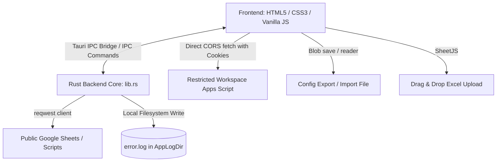

# Technical Architecture Document - SAPID license analyser

This document provides a technical overview of the architectural design, security protections, data flow, and directories layout for the **SAPID license analyser** application.

---

## 1. System Topology Overview

SAPID license analyser is a cross-platform desktop application constructed on the **Tauri v2** framework. It leverages a multi-process architecture to separate concerns, providing a sandboxed user interface linked to a secure native Rust backend.



- **Frontend Core**: A single-page application built on standard semantic HTML5, vanilla CSS3 (utilizing custom properties, media queries, and animations), and modern JavaScript (ES6). Data visualizations are powered by **Chart.js**, and binary spreadsheet parsing is done in-memory via **SheetJS (xlsx)**.
- **Rust Backend Core**: Manages native shell interactions, directory structures, HTTP clients with custom certificate validation, and disk write processes.

---

## 2. Security Design & SSRF Protections

To protect the client system against malicious external inputs or unauthorized endpoints, the application implements a strict security boundary:

1. **SSRF Validation**:
   In `src-tauri/src/lib.rs`, all sync URLs inputted by the user are parsed and checked against a strict whitelist before any HTTP client invocation. The host domain MUST resolve exactly to `google.com` or end with `.google.com`.
   ```rust
   fn validate_google_host(url_str: &str) -> Result<Url, String> {
       let parsed = Url::parse(url_str).map_err(|_| "Invalid URL format.".to_string())?;
       let host = parsed.host_str().unwrap_or("");
       if host != "google.com" && !host.ends_with(".google.com") {
           return Err("Invalid URL. Host must be google.com or a subdomain of google.com.".to_string());
       }
       Ok(parsed)
   }
   ```
2. **IPC Command Isolation**:
   The frontend operates in a sandboxed context. Filesystem writes (logs) and directory browsing (Explorer launch) are executed by Rust command handlers (`append_log`, `open_log_directory`) registered via Tauri handlers, keeping the frontend isolated from arbitrary operating system access.

---

## 3. Data Synchronization & Fetch Workflows

Data sync supports public standard Google Sheets, Enterprise Workspace restricted sheets, and local Excel uploads:

### Workflow A: Standard Google Sheets (Publicly Shared)
1. User input URL is converted to a direct CSV export endpoint by extracting the spreadsheet ID and gid values:
   `https://docs.google.com/spreadsheets/d/{ID}/gviz/tq?tqx=out:csv&gid={GID}`
2. The frontend sends an IPC command `fetch_sheet_data` to the Rust core.
3. The Rust backend uses an asynchronous `reqwest` client to fetch the CSV payload.
4. The CSV data is sent back via IPC, andparsed into JSON client-side using SheetJS.

### Workflow B: Restricted Domain Sheets (Enterprise Accounts)
1. Since the Rust client does not possess the user's Enterprise Google Workspace login cookies, the backend cannot directly access restricted sheets.
2. In this case, the Rust backend detects the URL is domain-restricted and returns `FETCH_DIRECT`.
3. The frontend WebView directly triggers a native browser fetch request (`fetch(url, { credentials: 'include' })`). Since the WebView shares the active Google Workspace browser cookie session, the request completes successfully.
4. The 2D array output is parsed and normalized into standard row ledgers in the frontend.

---

## 4. Local Logging & Persistence

- **State Persistence**: The active synced URL and the spreadsheet row structures are cached inside browser `localStorage`.
- **Logs Handler**: When error events (network timeouts, sheet parsing failures) occur in the frontend, they trigger the `append_log` Tauri command.
- **Log Storage File**: Logs are saved inside the OS app data directory, resolved dynamically using Tauri's Manager path bindings:
  - Windows: `%APPDATA%/Local/com.sapid.license.analyser/logs/error.log`
- **Explorer Binding**: Clicking "Open Logs Folder" calls the custom Rust command `open_log_directory` which spawns the OS Explorer process pointing specifically to the logs directory, preserving platform compatibility.

---

## 5. Build and Distribution Configuration

Tauri is configured via `src-tauri/tauri.conf.json` to package the application for target operating systems:
- **Build Target**: `"all"` builds native platform installers.
- **Windows Packaging**: Relies on the WiX Toolset to compile a standard `.msi` package or NSIS to produce a lightweight single `.exe` setup.
- **Frontend Dist**: Configured to load assets directly from the `../src` directory without requiring node compile build steps, keeping compile chains highly stable.
